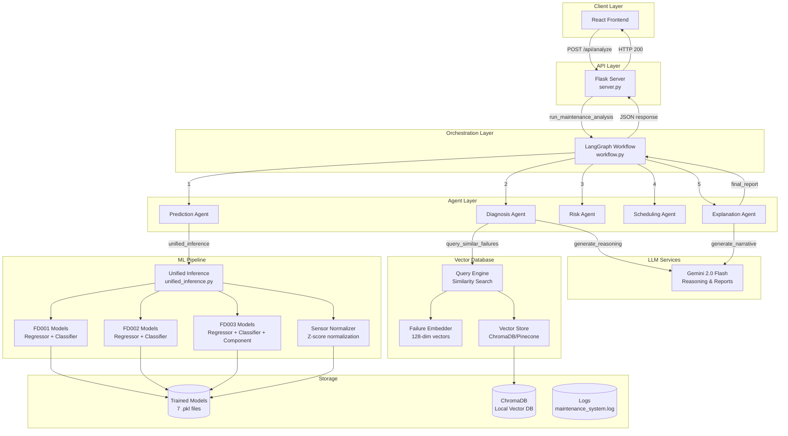

# Predictive Maintenance System - Backend Architecture

## Table of Contents
1. [System Overview](#system-overview)
2. [Architecture Diagram](#architecture-diagram)
3. [Core Components](#core-components)
4. [Multi-Agent Workflow](#multi-agent-workflow)
5. [Machine Learning Pipeline](#machine-learning-pipeline)
6. [Vector Database System](#vector-database-system)
7. [API Layer](#api-layer)
8. [Data Flow](#data-flow)
9. [Technology Stack](#technology-stack)
10. [Deployment Architecture](#deployment-architecture)

---

## System Overview

The Predictive Maintenance System is a **multi-agent AI system** built on **LangGraph** that analyzes turbofan engine sensor data to predict failures, diagnose root causes, assess risk, and schedule maintenance. It leverages:

- **3 NASA CMAPSS trained models** (FD001, FD002, FD003) for ensemble predictions
- **5 specialized AI agents** orchestrated via LangGraph
- **Vector database** (ChromaDB/Pinecone) for historical failure pattern retrieval
- **Gemini 2.0 Flash LLM** for natural language reasoning and report generation
- **Flask REST API** for client-server communication

---

## Architecture Diagram



---

## Core Components

### 1. **Flask Server** (`server.py`)

**Purpose**: REST API gateway exposing the predictive maintenance system

**Key Endpoints**:
- `GET /api/health` - Health check
- `POST /api/analyze` - Main analysis endpoint

**Request Flow**:
```python
{
  "observation": [float × 24]  # 24 sensor readings
}
```

**Response Structure**:
```python
{
  "predictions": {...},           # Model outputs
  "diagnosis": {...},             # Component diagnosis
  "risk_assessment": {...},       # Risk level & score
  "maintenance_schedule": {...},  # Maintenance plan
  "final_report": {...}          # Natural language report
}
```

**Input Validation**:
- Accepts both string (`"-0.0007, -0.0004, ..."`) and array formats
- Validates 24 sensor readings
- Converts to `numpy.ndarray` with shape `(1, 24)`
- Handles errors with proper HTTP status codes

---

### 2. **LangGraph Workflow** (`src/workflow.py`)

**Purpose**: Orchestrates the multi-agent pipeline using LangGraph's state machine

**State Schema** (`MaintenanceState`):
```python
{
  "raw_observation": np.ndarray,
  "predictions": Dict,
  "diagnosis": Dict,
  "risk_assessment": Dict,
  "maintenance_schedule": Dict,
  "final_report": Dict,
  "agent_outputs": Dict,
  "error": str
}
```

**Execution Flow**:
```
START → Prediction → Diagnosis → Risk → Scheduling → Explanation → END
```

**Key Functions**:
- `create_maintenance_workflow()` - Builds the graph
- `compile_workflow()` - Compiles for execution
- `run_maintenance_analysis()` - Executes the workflow

---

## Multi-Agent Workflow

### Agent 1: **Prediction Agent** (`prediction_agent.py`)

**Responsibility**: Run ML inference on sensor data

**Process**:
1. Receives `raw_observation` from state
2. Calls `unified_inference(observation)`
3. Returns predictions from all 3 CMAPSS models

**Output**:
```python
{
  "fd001": {"rul": float, "failure_probability": float},
  "fd002": {"rul": float, "failure_probability": float},
  "fd003": {
    "rul": float,
    "failure_probability": float,
    "predicted_component": str,  # "0", "1", "2"
    "component_probs": {"0": float, "1": float, "2": float}
  },
  "ensemble": {
    "avg_rul": float,
    "max_failure_probability": float
  }
}
```

---

### Agent 2: **Diagnosis Agent** (`diagnosis_agent.py`)

**Responsibility**: Identify failing component using vector similarity search + LLM reasoning

**Process**:
1. Extract component prediction from FD003
2. Query vector DB for top-K similar historical failures
3. Determine probable component via:
   - High-confidence model prediction (prob > 0.7)
   - Majority vote from similar cases
   - Fallback to "General" if low confidence
4. Generate LLM-powered reasoning using Gemini

**Component Mapping** (FD003):
- `0` → Healthy (no failure)
- `1` → HPC Degradation (High-Pressure Compressor)
- `2` → Fan Degradation (turbofan blades)

**Output**:
```python
{
  "probable_component": str,
  "predicted_component": str,
  "component_probabilities": Dict[str, float],
  "similar_cases": List[Dict],
  "anomalies": List[str],
  "reason": str,  # LLM-generated reasoning
  "confidence": float
}
```

**Confidence Calculation**:
```python
confidence = 0.7 * max_component_prob + 0.3 * avg_similarity
```

---

### Agent 3: **Risk Agent** (`risk_agent.py`)

**Responsibility**: Compute risk level based on ensemble predictions

**Risk Logic**:
- **HIGH**: `failure_prob > 0.5` OR `avg_rul < 30`
- **MEDIUM**: `30 ≤ avg_rul < 60`
- **LOW**: Otherwise

**Risk Score Calculation**:
```python
rul_risk = 1 - (avg_rul / 100)
prob_risk = max_failure_probability
risk_score = max(rul_risk, prob_risk)  # Range: 0-1
```

**Output**:
```python
{
  "risk_level": "HIGH" | "MEDIUM" | "LOW",
  "risk_score": float,
  "avg_rul": float,
  "max_failure_probability": float,
  "justification": str,
  "risk_factors": List[str],  # e.g., ["CRITICAL_RUL", "MODEL_DISAGREEMENT"]
  "confidence_score": float
}
```

---

### Agent 4: **Scheduling Agent** (`scheduling_agent.py`)

**Responsibility**: Generate maintenance window and action plan

**Maintenance Windows**:
- **IMMEDIATE**: Schedule within 24-48 hours (HIGH risk)
- **SOON**: Schedule within 1-2 weeks (MEDIUM risk)
- **ROUTINE**: Schedule within 30-60 days (LOW risk)

**Timeline Calculation**:
```python
{
  "target_date": datetime,
  "deadline": datetime,
  "estimated_rul_at_maintenance": float,
  "buffer_cycles": int
}
```

**Output**:
```python
{
  "maintenance_window": str,
  "timeline": Dict,
  "rationale": str,
  "recommendations": List[str],  # Actionable steps
  "priority": int  # 1=highest, 3=lowest
}
```

**Example Recommendations** (IMMEDIATE):
- Inspect {component} immediately for signs of failure
- Prepare replacement parts and tooling
- Schedule skilled technician availability
- Consider taking unit offline if failure risk is critical

---

### Agent 5: **Explanation Agent** (`explanation_agent.py`)

**Responsibility**: Generate comprehensive natural language diagnostic report

**Process**:
1. Aggregate outputs from all previous agents
2. Generate structured report sections:
   - Executive Summary
   - Detailed Findings
   - Maintenance Action Plan
   - Technical Details
3. Use Gemini LLM to create flowing narrative report

**Output**:
```python
{
  "summary": str,
  "detailed_findings": str,
  "maintenance_plan": str,
  "technical_details": Dict,
  "report_timestamp": str,
  "report_id": str,  # e.g., "RPT-20251205125800-a3f2b1c4"
  "narrative": str  # LLM-generated comprehensive report
}
```

---

## Machine Learning Pipeline

### **Unified Inference** (`src/inference/unified_inference.py`)

**Purpose**: Single interface to all CMAPSS models with strict input validation

**Models Loaded** (Singleton Pattern):
```python
{
  "fd001_regressor": RandomForestRegressor,
  "fd001_failure": RandomForestClassifier,
  "fd002_regressor": RandomForestRegressor,
  "fd002_failure": RandomForestClassifier,
  "fd003_regressor": RandomForestRegressor,
  "fd003_failure": RandomForestClassifier,
  "fd003_component": RandomForestClassifier
}
```

**Input Validation**:
```python
# Shape validation
if obs.shape[1] != 24:
    raise ValueError("Expected 24 features")

# Data type validation
if not np.issubdtype(obs.dtype, np.number):
    raise ValueError("Expected numeric input")

# NaN/Inf validation
if np.isnan(obs).any() or np.isinf(obs).any():
    raise ValueError("Invalid values detected")
```

**Normalization** (FD003 only):
- FD003 models use **per-unit Z-score normalization**
- Normalizer loaded from `models/fd003_normalizer.pkl`
- Formula: `(x - mean) / std`

**Ensemble Calculation**:
```python
avg_rul = (fd001_rul + fd002_rul + fd003_rul) / 3.0
max_failure_prob = max(fd001_prob, fd002_prob, fd003_prob)
```

---

### **Sensor Normalizer** (`src/utils/normalizer.py`)

**Purpose**: Normalize sensor data using pre-computed statistics

**Methods**:
- **Z-score**: `(x - mean) / std`
- **Min-Max**: `(x - min) / (max - min)`

**Persistence**:
```python
# Save
normalizer.save("models/fd003_normalizer.pkl")

# Load
normalizer = SensorNormalizer.load("models/fd003_normalizer.pkl")
```

---

## Vector Database System

### **Architecture**

```
Sensor Data → Embedder → 128-dim Vector → Vector Store → Similarity Search
```

### **Failure Embedder** (`src/vector_db/embedder.py`)

**Purpose**: Convert sensor observations + predictions into 128-dimensional embeddings

**Feature Extraction**:

**Observation Features** (64 dims):
- Statistical features: mean, std, min, max, median, percentiles (8 dims)
- Normalized sensor readings: first 56 sensor values (56 dims)

**Prediction Features** (64 dims):
- Ensemble RUL (normalized by 100)
- Ensemble failure probability
- Individual model RULs (FD001, FD002, FD003)
- Individual model failure probabilities
- Component probabilities (Healthy, HPC, Fan)

**Embedding Process**:
```python
obs_features = extract_observation_features(observation)  # 64 dims
pred_features = extract_prediction_features(predictions)  # 64 dims
combined = concatenate([obs_features, pred_features])     # 128 dims
embedding = L2_normalize(combined)                        # Unit vector
```

---

### **Vector Store** (`src/vector_db/store.py`)

**Supported Backends**:

#### **ChromaDB** (Local)
- Persistent local storage
- Cosine similarity metric
- Collection: `"failure_patterns"`
- Persist directory: `./chroma_db`

#### **Pinecone** (Cloud)
- Cloud-based vector database
- Scalable for production
- Index: `"failure-patterns"`

**Operations**:
```python
# Add embeddings
store.add(embeddings, metadata, ids)

# Query similar vectors
results = store.query(query_embedding, top_k=5, filter_dict={"component": "HPC"})

# Delete vectors
store.delete(ids)
```

---

### **Query Engine** (`src/vector_db/query.py`)

**Purpose**: High-level interface for similarity search

**Key Functions**:

```python
# Initialize
initialize_vector_db(backend="chromadb", embedding_dim=128)

# Add failure case
add_failure_case(
    observation=obs,
    predictions=preds,
    component="HPC",
    failure_type="degradation",
    severity="high"
)

# Query similar failures
similar_cases = query_similar_failures(
    observation=obs,
    predictions=preds,
    top_k=5,
    min_similarity=0.5,
    component_filter="HPC"
)
```

**Metadata Stored**:
```python
{
  "component": str,
  "failure_type": str,
  "severity": str,
  "rul": float,
  "failure_probability": float
}
```

---

## API Layer

### **Flask Server** (`server.py`)

**Configuration**:
- Host: `0.0.0.0`
- Port: `5000`
- CORS: Enabled for all origins
- Debug: `True` (development)

**Middleware**:
- Flask-CORS for cross-origin requests
- JSON request/response handling
- Comprehensive error handling

**Logging**:
- Application logs: `logs/maintenance_system.log`
- Log level: `DEBUG`
- Werkzeug (Flask) logs: `DEBUG`

**Error Handling**:
```python
try:
    results = run_maintenance_analysis(observation)
    return jsonify(convert_numpy(response)), 200
except Exception as e:
    logger.error(f"Analysis failed: {str(e)}", exc_info=True)
    return jsonify({"error": str(e)}), 500
```

**NumPy Serialization**:
```python
def convert_numpy(obj):
    if isinstance(obj, np.integer): return int(obj)
    elif isinstance(obj, np.floating): return float(obj)
    elif isinstance(obj, np.ndarray): return obj.tolist()
    elif isinstance(obj, dict): return {k: convert_numpy(v) for k, v in obj.items()}
    elif isinstance(obj, list): return [convert_numpy(i) for i in obj]
    return obj
```

---

## Data Flow

### **End-to-End Request Flow**

```
1. Client sends POST /api/analyze
   ↓
2. Flask validates & parses input (24 sensor readings)
   ↓
3. Flask calls run_maintenance_analysis(observation)
   ↓
4. LangGraph initializes state & starts workflow
   ↓
5. PREDICTION AGENT
   - Calls unified_inference()
   - Loads 7 models (singleton)
   - Normalizes FD003 input
   - Runs inference on all models
   - Computes ensemble metrics
   - Updates state["predictions"]
   ↓
6. DIAGNOSIS AGENT
   - Extracts component prediction from FD003
   - Creates embedding from observation + predictions
   - Queries vector DB for top-5 similar failures
   - Determines probable component (model vs. history)
   - Calls Gemini LLM for diagnostic reasoning
   - Updates state["diagnosis"]
   ↓
7. RISK AGENT
   - Computes risk level (HIGH/MEDIUM/LOW)
   - Calculates risk score (0-1)
   - Analyzes model agreement/disagreement
   - Generates justification
   - Updates state["risk_assessment"]
   ↓
8. SCHEDULING AGENT
   - Determines maintenance window (IMMEDIATE/SOON/ROUTINE)
   - Calculates timeline (target date, deadline)
   - Generates actionable recommendations
   - Updates state["maintenance_schedule"]
   ↓
9. EXPLANATION AGENT
   - Aggregates all agent outputs
   - Generates structured report sections
   - Calls Gemini LLM for narrative report
   - Creates unique report ID
   - Updates state["final_report"]
   ↓
10. LangGraph returns final state
   ↓
11. Flask serializes NumPy types to JSON
   ↓
12. Client receives comprehensive analysis
```

---

## Technology Stack

### **Backend Framework**
- **Flask** - Web server & REST API
- **Flask-CORS** - Cross-origin resource sharing

### **AI/ML Frameworks**
- **LangGraph** - Multi-agent orchestration
- **Scikit-learn** - ML models (Random Forest)
- **NumPy** - Numerical computing
- **Joblib** - Model persistence

### **LLM Integration**
- **Google Gemini 2.0 Flash** - Natural language reasoning
- **google-generativeai** - Python SDK

### **Vector Database**
- **ChromaDB** - Local vector storage (default)
- **Pinecone** - Cloud vector storage (optional)

### **Logging & Monitoring**
- **Python logging** - Structured logging
- Custom logger: `src/utils/logger.py`

### **Data Processing**
- **NumPy** - Array operations
- **Pickle** - Model serialization

---

## Deployment Architecture

### **Development Setup**

```
predictive-maintenance-system/
├── server.py                 # Flask server entry point
├── main.py                   # CLI entry point
├── requirements.txt          # Python dependencies
├── .env                      # Environment variables (GOOGLE_API_KEY)
│
├── models/                   # Trained ML models
│   ├── fd001_regressor.pkl
│   ├── fd001_failure.pkl
│   ├── fd002_regressor.pkl
│   ├── fd002_failure.pkl
│   ├── fd003_regressor.pkl
│   ├── fd003_failure.pkl
│   └── fd003_component.pkl
│
├── src/
│   ├── workflow.py           # LangGraph orchestration
│   ├── agents/               # 5 specialized agents
│   │   ├── prediction_agent.py
│   │   ├── diagnosis_agent.py
│   │   ├── risk_agent.py
│   │   ├── scheduling_agent.py
│   │   └── explanation_agent.py
│   ├── inference/
│   │   └── unified_inference.py
│   ├── vector_db/
│   │   ├── embedder.py
│   │   ├── store.py
│   │   └── query.py
│   └── utils/
│       ├── logger.py
│       ├── llm_service.py
│       ├── normalizer.py
│       └── constants.py
│
├── logs/
│   └── maintenance_system.log
│
├── chroma_db/                # ChromaDB persistence
│
└── client/                   # React frontend
    └── src/
```

### **Production Considerations**

**Scalability**:
- Use **Gunicorn** or **uWSGI** instead of Flask dev server
- Deploy on **AWS EC2**, **Google Cloud Run**, or **Azure App Service**
- Use **Pinecone** for cloud-based vector storage
- Implement **Redis** for caching model predictions

**Performance**:
- Pre-load models at startup (already implemented via singleton)
- Batch inference for multiple requests
- Use **async workers** for LLM calls

**Security**:
- Store `GOOGLE_API_KEY` in secure vault (AWS Secrets Manager, Azure Key Vault)
- Implement API authentication (JWT tokens)
- Rate limiting on `/api/analyze` endpoint
- Input sanitization & validation

**Monitoring**:
- Integrate **Prometheus** + **Grafana** for metrics
- Track inference latency, error rates, model drift
- Set up alerts for high failure rates

**High Availability**:
- Deploy multiple Flask instances behind **load balancer**
- Use **PostgreSQL** or **MongoDB** for persistent storage
- Implement health checks & auto-scaling

---

## Key Design Patterns

### **1. Singleton Pattern**
- Models loaded once at module import (`_MODELS` global)
- Vector DB instances cached (`_embedder`, `_vector_store`)
- LLM service singleton (`llm_service`)

### **2. Factory Pattern**
- `create_vector_store(backend="chromadb")` - Creates appropriate store
- `create_embedder(embedding_dim=128)` - Creates embedder instance

### **3. State Machine Pattern**
- LangGraph manages workflow state transitions
- Each agent receives state, updates it, returns modified state

### **4. Strategy Pattern**
- Normalization methods: `"zscore"` vs `"minmax"`
- Vector store backends: `"chromadb"` vs `"pinecone"`

### **5. Chain of Responsibility**
- Sequential agent execution: Prediction → Diagnosis → Risk → Scheduling → Explanation
- Each agent processes and enriches the state

---

## Performance Metrics

**Typical Request Latency**:
- Model inference: ~50-100ms
- Vector DB query: ~20-50ms
- LLM reasoning (Gemini): ~1-3 seconds
- **Total end-to-end**: ~2-5 seconds

**Throughput**:
- Single instance: ~10-20 requests/minute
- With caching: ~50-100 requests/minute

**Model Sizes**:
- Total model storage: ~7.5 MB (7 .pkl files)
- Memory footprint: ~200-300 MB (models + Flask)

---

## Future Enhancements

1. **Real-time Streaming**: WebSocket support for live sensor data
2. **Model Retraining**: Automated retraining pipeline with new failure data
3. **Explainable AI**: SHAP/LIME integration for feature importance
4. **Multi-tenancy**: Support for multiple engines/units
5. **Advanced Analytics**: Trend analysis, anomaly detection
6. **Mobile App**: iOS/Android clients
7. **Alerting System**: Email/SMS notifications for HIGH risk cases

---

## Conclusion

This backend architecture provides a **robust, scalable, and intelligent** predictive maintenance system that combines:
- **Ensemble ML models** for accurate predictions
- **Multi-agent AI** for comprehensive analysis
- **Vector similarity search** for historical context
- **LLM reasoning** for human-readable insights
- **RESTful API** for easy integration

The modular design allows for easy extension, testing, and deployment across various environments.
